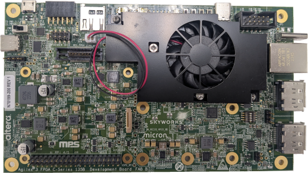

# Agilex 3 C-Series Golden Hardware Reference Design (GHRD)

This repository contains Golden Hardware Reference Design (GHRD) for Agilex 3 C-Series System On Chip (SoC) FPGA.
The GHRD is part of the Golden System Reference Design (GSRD), which provides a complete solution, including exercising soft IP in the fabric, booting to U-Boot, then Linux, and running sample Linux applications.
Refer to the [HPS GSRD User Guide for the Agilex 3 C-Series Development Kit](https://altera-fpga.github.io/latest/embedded-designs/agilex-3/c-series/gsrd/ug-gsrd-agx3/) for information about GSRD.

The [designs](#designs) are stored in individual folders. Each design can be opened, modified and compiled by using Quartus Prime software.
GHRD releases are created for each version of Quartus Prime Software. It is recommended to use the release for your version of Quartus Prime.
These reference designs demonstrate the system integration between Hard Processor System (HPS) and FPGA IPs.

## Baseline feature
This is applicable to all designs.
- Hard Processor System (HPS) enablement and configuration
  - Enable dual core Arm Cortex-A55 processor
  - HPS Peripheral and I/O (SD/MMC, EMAC, MDIO, USB, I3C, JTAG, UART, and GPIO)
  - HPS Clock and Reset
  - HPS FPGA Bridge and Interrupt
- HPS EMIF configuration (Inline ECC for LPDDR4 is enabled by default)
- System integration with FPGA IPs
  - Peripheral subsystem that consists of System ID, Programmable I/O (PIO) IP for controlling PushButton and LEDs.
  - Debug subsystem that consists of JTAG-to-Avalon Master IP to allow System-Console debug activity and FPGA content access through JTAG
  - 256KB of FPGA On-Chip Memory

## The GHRD use cases:
1. use the precompiled bitstream(sof) in release assets to programm the board.
2. open and compile the [designs](#designs) with Quartus Prime.
3. modify and compile the [designs](#designs) with Quartus Prime.

## Dependency
* Altera Quartus Prime 25.3
* Supported Board
  - Agilex 3 FPGA and SoC C-Series Development Kit: [Devkit User Guide](https://www.intel.com/content/www/us/en/docs/programmable/851698/current)
  

## Tested Platform for the GHRD Build Flow
* SUSE Linux Enterprise Server 15 SP4


## Setup

Several tools are required to be in the path.

* Altera Quartus Prime 25.3
* Python 3.11.5 (only required when using command line to build)

### Example Setup for Altera Quartus Prime tools
This is recommended, when using command line to build.
```bash
export QUARTUS_ROOTDIR=~/intelFPGA_pro/25.3/quartus
```
Note: Adapt the path above to where Quartus Prime is installed.

```bash
export PATH="$QUARTUS_ROOTDIR/bin:$QUARTUS_ROOTDIR/../qsys/bin:$QUARTUS_ROOTDIR/../niosv/bin:$QUARTUS_ROOTDIR/sopc_builder/bin:$QUARTUS_ROOTDIR/../questa_fe/bin:$QUARTUS_ROOTDIR/../syscon/bin:$QUARTUS_ROOTDIR/../riscfree/RiscFree:$PATH"'
```

## Quick start
### Notes
- Command line and Quartus GUI should not be used intertwined.
- Mixing both might not generate some fileset correctly and fail the build.

### using command line
Copy and run the desired make command from [designs](#designs) in the root directory.
After build, the design files (zip, sof and rbf) can be found in install/designs folder.

### using Quartus GUI
- Launch Quartus.
- Open the project. Example: a3cw135-devkit-oobe/legacy-baseline/top.qpf
- Click the play button to compile the design.
- The compiled sof can be found in output_folders of the project path.

## Designs

### Agilex 3 FPGA and SoC C-Series Development Kit
Refer to the individual readme for details of the design.

* [a3cw135-devkit-oobe/legacy-baseline](a3cw135-devkit-oobe/legacy-baseline/README.md) :
  Legacy baseline GHRD for the Agilex 3 FPGA and SoC C-Series Development Kit.
```bash
make a3cw135-devkit-oobe-legacy-baseline-legacy_baseline-all
```

## Install location:
After build, the design files (zip, sof and rbf) can be found in install/designs folder.
These files are also uploaded as github release assets.
- \<design_name>**.zip**
  - This is the archeived project files of the individual GHRD.
- \<design_name>**.sof**
  - Compiled bitstream. Can be programm on board.
- \<design_name>**hps_debug.sof**
  - This bitstream is injected with hps wipe program. This creates a wait loop to boot with arm debugger.
  Refer [readme](a3cw135-devkit-oobe/legacy-baseline/software/hps_debug/README.md)
